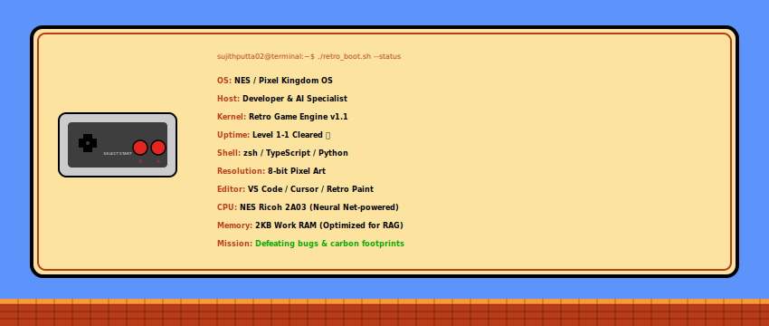
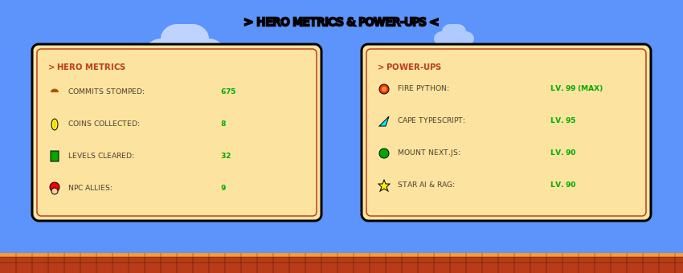
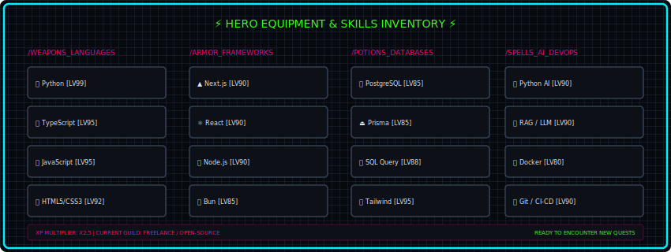
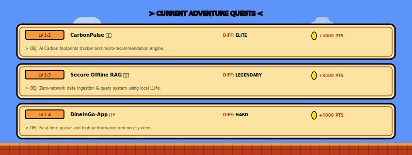

<!-- RETRO GAME LEVEL (ANIMATED STANDALONE SVG) -->

🎮 **Full-Stack Developer & AI Specialist**
*Architecting high-performance systems and intelligent, game-changing user experiences.*

---

### 🕹️ GAME SYSTEM OVERVIEW (neofetch)

  

---

### 👾 HERO SELECT & STATS STATUS BOARD (STANDALONE SVG)

  

---

### 🛡️ HERO EQUIPMENT & SKILLS INVENTORY (STANDALONE SVG)

  

---

### 🍄 CURRENT ADVENTURE QUESTS (Projects)

  

---

### 📊 SYSTEM PERFORMANCE METRICS

<table border="0" cellpadding="0" cellspacing="0" width="100%">
  <tr>
    <td width="50%" valign="top" align="center">
      
    </td>
    <td width="50%" valign="top" align="center">
      
    </td>
  </tr>
  <tr>
    <td colspan="2" align="center">
       
      
    </td>
  </tr>
</table>

 

#### 📊 Contribution Activity

 

#### 🐍 My Contribution Grid
<picture>
  <source media="(prefers-color-scheme: dark)" srcset="https://raw.githubusercontent.com/sujithputta02/sujithputta02/output/snake-dark.svg" />
  <source media="(prefers-color-scheme: light)" srcset="https://raw.githubusercontent.com/sujithputta02/sujithputta02/output/snake-light.svg" />
  
</picture>

---

  

