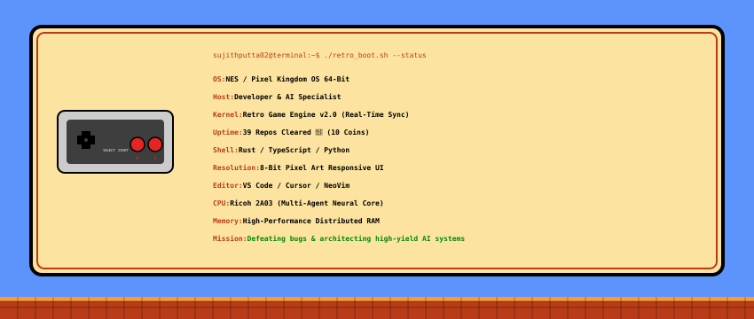
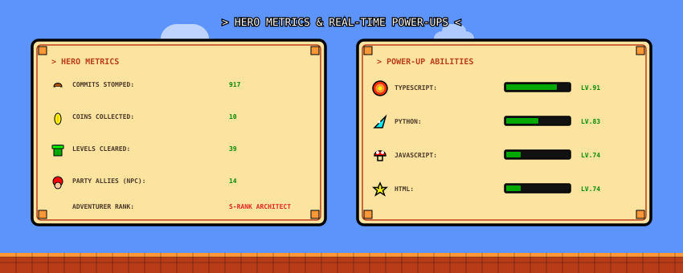
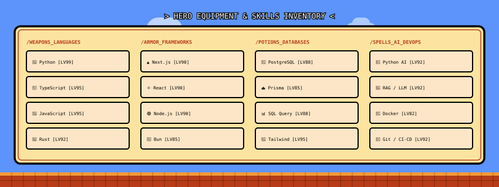
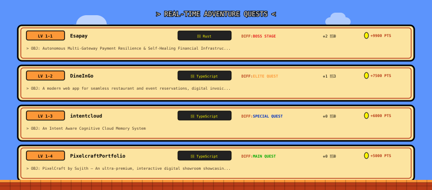
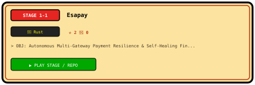
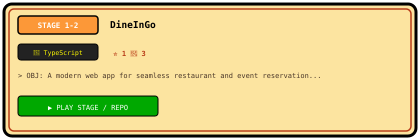
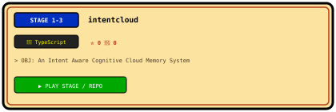
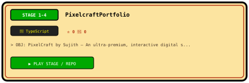
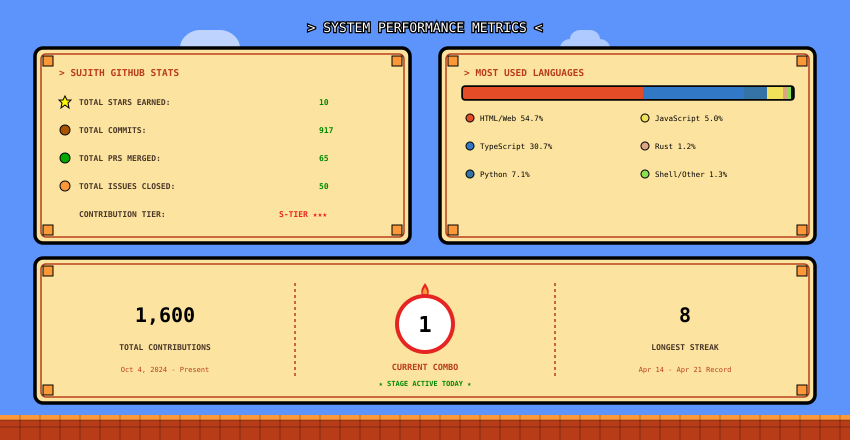

<!-- RETRO GAME LEVEL (ANIMATED STANDALONE SVG) -->

🎮 **Full-Stack Developer & AI Specialist**  
*Architecting high-performance systems and intelligent, game-changing user experiences.*

---

### 🕹️ GAME SYSTEM OVERVIEW

  

---

### 👾 HERO SELECT & STATS STATUS BOARD

  

---

### 🛡️ HERO EQUIPMENT & SKILLS INVENTORY

  

---

### 🍄 REAL-TIME ADVENTURE QUESTS (WARP ZONE)

  <!-- Master Animated Quest Board -->
  
  
    
  
  <!-- Interactive Clickable Quest Cartridges -->
  <table border="0" cellpadding="0" cellspacing="8" width="100%">
    <tr>
      <td width="50%" align="center" valign="top">
        
      </td>
      <td width="50%" align="center" valign="top">
        
      </td>
    </tr>
    <tr>
      <td width="50%" align="center" valign="top">
        
      </td>
      <td width="50%" align="center" valign="top">
        
      </td>
    </tr>
  </table>

   
  

---

### 📊 SYSTEM PERFORMANCE METRICS

  

 

#### 🐍 My Contribution Grid
<picture>
  <source media="(prefers-color-scheme: dark)" srcset="https://raw.githubusercontent.com/sujithputta02/sujithputta02/output/snake-dark.svg" />
  <source media="(prefers-color-scheme: light)" srcset="https://raw.githubusercontent.com/sujithputta02/sujithputta02/output/snake-light.svg" />
  
</picture>

---

  

